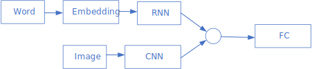
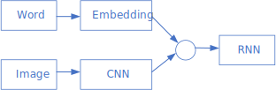
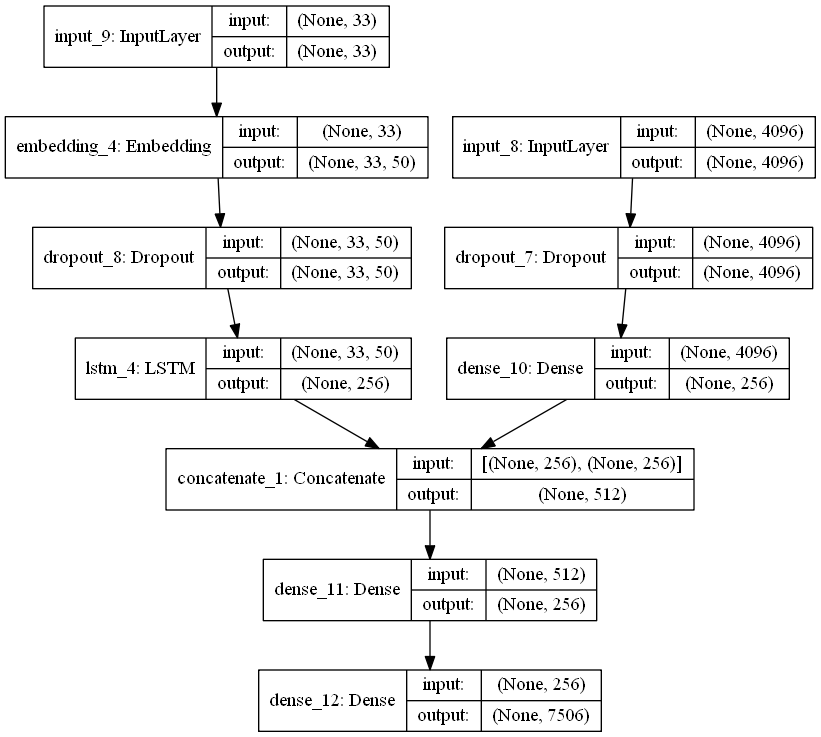
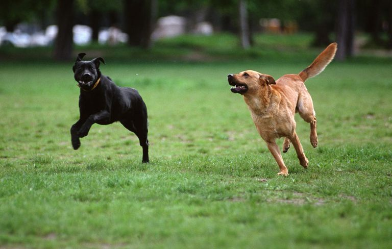

# Image Caption using Neural Networks

Imagine captioning is the task of the creation of a description that accurately captures the contents of an image. Several classes of approaches exist for this problem. One approach is to frame this problem as an **image-sentence retrieval problem**. In this approach, the closest caption in the training set is transferred to the test image. Or, the captions in the training set is broken up according to different features in the image and are combined together based on existing features of the test image. The retrieval approach can only generate descriptions that are already present in the training set. 

A second approach to the image caption problem is to **generate novel descriptions** using cascades of neural nerworks. In this approach, features in the image is extracted using a convolutional neural network (CNN) and these features are used with a recurrent neural network (RNN) to generate a caption. This approach can be divided into several broad classes:

1. **RNN as language generator**: The extracted image features are used as input to to an RNN based language generator. The RNN generate word sequences conditioned upon the image input.

2. **RNN as language model**: The RNN is used as a language model to encode word representations, which are then combined with the image features as input to another language generation stage.

We will compare the above approaches to generate novel image captions.

## RNN as Language Generator

Many work on image captioning has been done using this approach ([Karpathy et al](https://cs.stanford.edu/people/karpathy/cvpr2015.pdf), [Chen et al](https://www.cv-foundation.org/openaccess/content_cvpr_2015/papers/Chen_Minds_Eye_A_2015_CVPR_paper.pdf)). In our approach, we will use a simplied model where the image features are concatenated with word embeddings and fed into a RNN. 


### Neural Network Model

The features of the images to be captioned are extracted using a VGG16 CNN that as been pretrained using ImageNet data. The output of the FC8 layer of VGG16 is fed to another dense layer to extract the image feature. The weights of the VGG16 CNN are frozen when we train our RNN language generator. The additional dense layer is trainable

The words are embedded using the pretrained wording GloVE embeddings. The embeddings are not trained further in our generative model.

The image features and word embeddings are concatenated together and input to an LSTM RNN. Te output of the RNN is sampled as used as caption to the image. A special "START" token is used to initialize the generation process, and the process is terminated when an "END" token is sampled.


### Training

TBD

### Training Loss

TBD

## RNN as Language Model

Using RNN as a language model is not as common as the previous approach, but there are some very good results which have better performance than the previous approach ([Mao et al](https://arxiv.org/abs/1412.6632)). In our approach, the word embeddings are input to the RNN, and the final state of the RNN is combined with image features and input to another neural network to predict the next word in the caption. 

### Neural Network Model

Similarily to using the RNN as language generator, the features of the images to be captioned are extracted using a VGG16 CNN that as been pretrained using ImageNet data. We use the output of the FC8 layer of VGG16 as the image feature. The weights of the VGG16 CNN are frozen when we train our RNN language generator.

The words are also embedded using the pretrained wording GloVE embeddings. The embeddings are not trained further in our generative model.

The word embeddings of the partially generated caption are then used as input to an LSTM RNN. The final state of the RNN is combined with the extracted image features and input to another neural network to predict the next word in the caption. A special "START" token is used to initialize the generation process, and the process is terminated when an "END" token is sampled.



### Training

Since the output is generated by a fully connected layer instead of a recurrent network, at each time step only 1 word can be generated. In other words, during training, if the reference caption has n words, then n-1 training sequences will be generated, each containing one more word than the previous. For example, if the reference caption is "the weather is great and the time is now", then the training sequences would be

| | Training Seq| Expected Oupput   |
|:---|:---|:---|
| 1 |"START"| the|
| 2 |the   |weather   |
| 3  |the weather   |is   |
| 4  |  the weather is | great  |
|  5 |the weather is great   |and   |
|  6 | the weather is great and  | the  |
|  7 | the weather is great and the  | time  |
|  8 |  the weather is great and the time |is   |
|  9 | the weather is great and the time is  | now  |
|  10 | the weather is great and the time is now  | "END"  |


### Training Loss

The model will output a one-hot vector and the error will be measured using categorical crossentropy.

## Evaluation Metric

To evaluate a candidate caption, it is compared to one or more reference captions. The metric of evaluation used is often a variation of the "precision" or "recall" metric. In particular, the BLEU metric, which is a metric based on the "precision" of the candidate, and the ROUGE metric, which is based various combinations of both the "precision" and the "recall" of the candidate is used. We first give a brief introduction to "precision" and "recall".

- **Precision** is the number of overlapping words between the reference and candidate divided by the total number of words in the *candidate*. 
- **Recall** is the number of overlappoing words divided by the total number of words in the *reference*. 

A third measure, **F-score** combines precision and recall together:  $$F-score = \frac{Precision * Recall}{Precision+Recall}$$

### BLEU

BLEU metirc is based on the precision value of the candidate. The precision is defined as the number of unigrams in the candidate that also apprears in a reference, divided by the total number of words in the candidate translation. For example, if the candidate sentence is "the the the the the" and the reference sentence is "the time is now and the weather is good", the precision would be 5/5 since all 5 words in the candidate appears in the reference. There are obvious issues with using simple precision to evaluate a candidate. BLEU uses a modified n-gram precision, where the number of appearances of a candidate word is clipped by the number of times it appears in the reference translation, and then divide by the total number of (unclipped) words in the candidate translation. In the previous example, the modified unigram precision is 2/5 since the word "the" only appears twice in the reference translation and thus the count for "the" is clipped to 2. The Bleu score is calculated by taking the count over all n-grams. 

To make it formal, Bleu is the averaged ratio of n-gram matches. For each i-gram, where i=1,2,...,N, we compute the ratio of the number of i-gram tuples in the candidate that also occurs in the reference: 

$$P(i)=\frac{matched(i)}{H(i)}$$

where H(i) is the number of i-gram tuples in the candidate. For a hypothesis of length n words, H(1)=n, H(2)=n-1, H(3)=n-2, etc..

$$matched(i)=\sum_{t_i}min(C_h(t_i),\max_j C_{hj}(t_i)),$$

where $t_i$ is an i-gram tuple in candidate; $C_h(t_i)$ is the number of times $t_i$ occurs in the candidate; $C_{hj}(t_i)$ is the number of times $t_i$ occurs in reference $j$ of this candidate. So we have the BLEU score as:

$$BLEU_a = (\prod_{i=1}^NP(i))^{1/N}.$$

We also use a brevity penalty, $\rho$ to penalize short translation:

$$\rho = exp(min(0, \frac{n-L}{n})),$$ where n is the length of the reference, and L is the length of the reference. When there is only one reference, L is the number of words in the reference. When there are multiple references, there are three different ways
to define L: average of all references, closest to the hypothesis length, and
shortest among all references. By default, we use the shortest.


Thus, $$BLEU_b=\rho BLEU_a$$


The BLEU metric only looks at the modified precision of the model. Some models have really high BLEU scores, but would be judged by a human to have poor performance. To have a more robust measurement, another metric is often used, the ROUGE metric.

### ROUGE

ROUGE is a set of metric that generates the precision, recall, and F-score of a candidate with respect to references. ROUGE stands for Recall-Oriented Understudy for Gisting Evaluation. It is first proposed by Lin et al in their paper [ROUGE: A Package for Automatic Evaluation of Summaries](https://www.aclweb.org/anthology/W04-1013)

- ROUGE-N: measures n-gram overlap statistics
- ROUGE-L:  Longest Common Subsequence (LCS) based statistics.  Longest common subsequence problem takes into account sentence level structure similarity naturally and identifies longest co-occurring in sequence n-grams automatically. An advantage of using LCS is that it does not require consecutive matches but in-sequence matches that reflect sentence level word order. Since it automatically includes longest in-sequence common n-grams, you don’t need a predefined n-gram length.
- ROUGE-W: Weighted LCS-based statistics that favors consecutive LCSes
- ROUGE-S – Is any pair of word in a sentence in order, allowing for arbitrary gaps. This can also be called skip-gram coocurrence. For example, skip-bigram measures the overlap of word pairs that can have a maximum of two gaps in between words. As an example, for the phrase “cat in the hat” the skip-bigrams would be “cat in, cat the, cat hat, in the, in hat, the hat”.
- ROUGE-SU: Skip-bigram plus unigram-based co-occurrence statistics


# Image Caption using RNN as a Language Model

In this project we will generate image captions using the RNN as a language model. We will proceed with the following steps.

1. Using pretrained CNN to extract image features. A pretrained VGG16 CNN will be used to extract image features which will be concatenated with the RNN output

2. Prepare training data. The training captions will be tokenized and embedded using the GLOVE word embeddings. The embeddings will be fed into the RNN. 

3. Model definition

4. Training the model

5. Generating novel image captions using the trained model. Test images and images from the internet will be used as input to the trained model to generate captions. The captions will be examined to determine the weaknesses of the model and suggest improvements.

6. Beam search. We will use beam search to generate better captions using the model.

7. Model evaluation. The model will be evaluated using the BLEU and ROUGE metric.


# 1. Obtain Features Using Pre-trained Image Models


```python
# from os import listdir
from pickle import dump
from pickle import load
from keras.applications.vgg16 import VGG16
from keras.preprocessing.image import load_img
from keras.preprocessing.image import img_to_array
from keras.applications.vgg16 import preprocess_input
from keras.models import Model
import numpy as np
from keras.preprocessing.text import Tokenizer
from collections import Counter
from keras.utils import to_categorical
from keras.models import Model
from keras.layers import Input
from keras.layers import Dense
from keras.layers import LSTM
from keras.layers import Embedding
from keras.layers import Dropout
from keras.layers.merge import add
from keras.utils import plot_model
from keras.preprocessing.sequence import pad_sequences
from keras.models import load_model
```

The VGG16 model is used to extract the image features. We first load the model.


```python
base_model = VGG16(include_top=True)
base_model.summary()
```

    _________________________________________________________________
    Layer (type)                 Output Shape              Param #   
    =================================================================
    input_1 (InputLayer)         (None, 224, 224, 3)       0         
    _________________________________________________________________
    block1_conv1 (Conv2D)        (None, 224, 224, 64)      1792      
    _________________________________________________________________
    block1_conv2 (Conv2D)        (None, 224, 224, 64)      36928     
    _________________________________________________________________
    block1_pool (MaxPooling2D)   (None, 112, 112, 64)      0         
    _________________________________________________________________
    block2_conv1 (Conv2D)        (None, 112, 112, 128)     73856     
    _________________________________________________________________
    block2_conv2 (Conv2D)        (None, 112, 112, 128)     147584    
    _________________________________________________________________
    block2_pool (MaxPooling2D)   (None, 56, 56, 128)       0         
    _________________________________________________________________
    block3_conv1 (Conv2D)        (None, 56, 56, 256)       295168    
    _________________________________________________________________
    block3_conv2 (Conv2D)        (None, 56, 56, 256)       590080    
    _________________________________________________________________
    block3_conv3 (Conv2D)        (None, 56, 56, 256)       590080    
    _________________________________________________________________
    block3_pool (MaxPooling2D)   (None, 28, 28, 256)       0         
    _________________________________________________________________
    block4_conv1 (Conv2D)        (None, 28, 28, 512)       1180160   
    _________________________________________________________________
    block4_conv2 (Conv2D)        (None, 28, 28, 512)       2359808   
    _________________________________________________________________
    block4_conv3 (Conv2D)        (None, 28, 28, 512)       2359808   
    _________________________________________________________________
    block4_pool (MaxPooling2D)   (None, 14, 14, 512)       0         
    _________________________________________________________________
    block5_conv1 (Conv2D)        (None, 14, 14, 512)       2359808   
    _________________________________________________________________
    block5_conv2 (Conv2D)        (None, 14, 14, 512)       2359808   
    _________________________________________________________________
    block5_conv3 (Conv2D)        (None, 14, 14, 512)       2359808   
    _________________________________________________________________
    block5_pool (MaxPooling2D)   (None, 7, 7, 512)         0         
    _________________________________________________________________
    flatten (Flatten)            (None, 25088)             0         
    _________________________________________________________________
    fc1 (Dense)                  (None, 4096)              102764544 
    _________________________________________________________________
    fc2 (Dense)                  (None, 4096)              16781312  
    _________________________________________________________________
    predictions (Dense)          (None, 1000)              4097000   
    =================================================================
    Total params: 138,357,544
    Trainable params: 138,357,544
    Non-trainable params: 0
    _________________________________________________________________
    

The feature extraction model will use the VGG16 input as model input. However, the second last layer "fc2" of VGG16 will be used as the output of our extraction model. This is so because we do not need the final softmax layer of VGG16. 


```python
model = Model(inputs=base_model.input, outputs=base_model.get_layer('fc2').output)
model.summary()
```

    _________________________________________________________________
    Layer (type)                 Output Shape              Param #   
    =================================================================
    input_1 (InputLayer)         (None, 224, 224, 3)       0         
    _________________________________________________________________
    block1_conv1 (Conv2D)        (None, 224, 224, 64)      1792      
    _________________________________________________________________
    block1_conv2 (Conv2D)        (None, 224, 224, 64)      36928     
    _________________________________________________________________
    block1_pool (MaxPooling2D)   (None, 112, 112, 64)      0         
    _________________________________________________________________
    block2_conv1 (Conv2D)        (None, 112, 112, 128)     73856     
    _________________________________________________________________
    block2_conv2 (Conv2D)        (None, 112, 112, 128)     147584    
    _________________________________________________________________
    block2_pool (MaxPooling2D)   (None, 56, 56, 128)       0         
    _________________________________________________________________
    block3_conv1 (Conv2D)        (None, 56, 56, 256)       295168    
    _________________________________________________________________
    block3_conv2 (Conv2D)        (None, 56, 56, 256)       590080    
    _________________________________________________________________
    block3_conv3 (Conv2D)        (None, 56, 56, 256)       590080    
    _________________________________________________________________
    block3_pool (MaxPooling2D)   (None, 28, 28, 256)       0         
    _________________________________________________________________
    block4_conv1 (Conv2D)        (None, 28, 28, 512)       1180160   
    _________________________________________________________________
    block4_conv2 (Conv2D)        (None, 28, 28, 512)       2359808   
    _________________________________________________________________
    block4_conv3 (Conv2D)        (None, 28, 28, 512)       2359808   
    _________________________________________________________________
    block4_pool (MaxPooling2D)   (None, 14, 14, 512)       0         
    _________________________________________________________________
    block5_conv1 (Conv2D)        (None, 14, 14, 512)       2359808   
    _________________________________________________________________
    block5_conv2 (Conv2D)        (None, 14, 14, 512)       2359808   
    _________________________________________________________________
    block5_conv3 (Conv2D)        (None, 14, 14, 512)       2359808   
    _________________________________________________________________
    block5_pool (MaxPooling2D)   (None, 7, 7, 512)         0         
    _________________________________________________________________
    flatten (Flatten)            (None, 25088)             0         
    _________________________________________________________________
    fc1 (Dense)                  (None, 4096)              102764544 
    _________________________________________________________________
    fc2 (Dense)                  (None, 4096)              16781312  
    =================================================================
    Total params: 134,260,544
    Trainable params: 134,260,544
    Non-trainable params: 0
    _________________________________________________________________
    

After the image model has been defined, we will use it to extract the features of all the images.


```python
features = dict()
for file in listdir('Flicker8k_Dataset'):
    img_path = 'Flicker8k_Dataset/' + file
    img = load_img(img_path, target_size=(224, 224)) #size is 224,224 by default
    x = img_to_array(img) #change to np array
    x = np.expand_dims(x, axis=0) #expand to include batch dim at the beginning
    x = preprocess_input(x) #make input confirm to VGG16 input format
    fc2_features = model.predict(x)
    
    name_id = file.split('.')[0] #take the file name and use as id in dict
    features[name_id] = fc2_features

dump(features, open('features.pkl', 'wb')) #cannot use JSON because ndarray is not JSON serializable
```

# 2. Preparing Text Caption Data

The Flickr8k images as well as captions for each image can be downloaded from the following links:  
[Flickr8k_Dataset](https://github.com/jbrownlee/Datasets/releases/download/Flickr8k/Flickr8k_Dataset.zip)  
[Flickr8k_text](https://github.com/jbrownlee/Datasets/releases/download/Flickr8k/Flickr8k_text.zip)

The dataset was gathered by Micah Hodosh et al from the University of Illinois at Urbana-Champaign. The description of the dataset can be found in their paper:  
[Framing Image Description as a Ranking Task:Data, Models and Evaluation Metrics](https://www.ijcai.org/Proceedings/15/Papers/593.pdf) [(alternative link)](https://pdfs.semanticscholar.org/9814/df8bd00ba999c4d1e305a7e9bca579dc7c75.pdf)

The text captions of the pictures from the paper is quoted below:
> The images in this data set focus on people or animals (mainly dogs) performing some action... The images were chosen from six different Flickr groups, and tend not to contain any well-known people or locations, but were manually selected to depict a variety of scenes and situations. In order to avoid ungrammatical captions, we only allowed workers from the United States who had passed a brief spelling and grammar test we devised to annotate our images. Because we were interested in conceptual descriptions, annotators were asked to write sentences that describe the depicted scenes, situations, events and entities (people, animals, other objects). We collected multiple captions for each image because there is a considerable degree of variance in the way many images can be described. As a consequence, the captions of the same images are often not direct paraphrases of each other: the same entity or event or situation can be described in multiple ways (man vs. bike rider, doing tricks vs. jumping), and while everybody mentions the bike rider, not everybody mentions the crowd or the ramp. The more dynamic nature of the images is also reflected in how they are being described: Captions in this data set have an average length of 11.8 words, only 11% of the captions for the Flickr 8K set contain no verb, and an additional 10% contain only common verbs. 

We will load the text data containing the captions for each picture. The data is saved in 'Flickr8k.token.txt' file. Here are a few lines from that file:
>1000268201_693b08cb0e.jpg#0	A child in a pink dress is climbing up a set of stairs in an entry way .  
1000268201_693b08cb0e.jpg#1	A girl going into a wooden building .  
1000268201_693b08cb0e.jpg#2	A little girl climbing into a wooden playhouse .  
1000268201_693b08cb0e.jpg#3	A little girl climbing the stairs to her playhouse .  
1000268201_693b08cb0e.jpg#4	A little girl in a pink dress going into a wooden cabin .  
1001773457_577c3a7d70.jpg#0	A black dog and a spotted dog are fighting  
1001773457_577c3a7d70.jpg#1	A black dog and a tri-colored dog playing with each other on the road .  
1001773457_577c3a7d70.jpg#2	A black dog and a white dog with brown spots are staring at each other in the street .  
1001773457_577c3a7d70.jpg#3	Two dogs of different breeds looking at each other on the road .  
1001773457_577c3a7d70.jpg#4	Two dogs on pavement moving toward each other .  
1002674143_1b742ab4b8.jpg#0	A little girl covered in paint sits in front of a painted rainbow with her hands in a bowl .  
1002674143_1b742ab4b8.jpg#1	A little girl is sitting in front of a large painted rainbow .  
1002674143_1b742ab4b8.jpg#2	A small girl in the grass plays with fingerpaints in front of a white canvas with a rainbow on it . 
1002674143_1b742ab4b8.jpg#3	There is a girl with pigtails sitting in front of a rainbow painting .  
1002674143_1b742ab4b8.jpg#4	Young girl with pigtails painting outside in the grass .  

Each line in the file contains the file name, followed by a separator '#', and a caption produced by one of the five workers indexed from 0 to 4. There are 5 entries or lines for each photo, corresponding to the 5 different captions.

We will create a dictionary with the filename as key and a list of corresponding caption as the value to store the data. We need to preprocess the data first before inserting into the dictionary. We need to:

1. Remove all numbers and punctuations
2. Change all letters to lower case
3. Remove words containing single characters
4. Add 'START' and 'END' to the target data

Removing all punctuation can be achieved through

The string.maketrans() method. This method takes 3 arguments:

- x - If only one argument is supplied, it must be a dictionary.
The dictionary should contain 1-to-1 mapping from a single character string to its translation OR a unicode number (97 for 'a') to its translation.
- y - If two arguments are passed, it must be two strings with equal length.
Each character in the first string is a replacement to its corresponding index in the second string.
- z - If three arguments are passed, each character in the third argument is mapped to None.

## 2.1 Loading Data Sets Image Id

The data is divided into traing/dev/test sets. The ids of the image belonging to each data set is stored in a text file. The following function loads the image ids for each data sets.

### Note on Keras tokenizer

keras.preprocessing.text.Tokenizer(nb_words=None, filters=base_filter(), 
    lower=True, split=" ")
Class for vectorizing texts, or/and turning texts into sequences (=list of word indexes, where the word of rank i in the dataset (starting at 1) has index i).

- Arguments: Same as text_to_word_sequence above.

    - nb_words: None or int. Maximum number of words to work with (if set, tokenization will be restricted to the top nb_words most common words in the dataset).

- Methods:

    - fit_on_texts(texts):

        - Arguments:
            - texts: list of texts to train on.
    - texts_to_sequences(texts)

        - Arguments:
            - texts: list of texts to turn to sequences.
            - Return: list of sequences (one per text input).
            - texts_to_sequences_generator(texts): generator version of the above.

        - Return: yield one sequence per input text.

    - texts_to_matrix(texts):

        - Return: numpy array of shape (len(texts), nb_words).
        - Arguments:
            - texts: list of texts to vectorize.
            - mode: one of "binary", "count", "tfidf", "freq" (default: "binary").

    - fit_on_sequences(sequences):

        - Arguments:
            - sequences: list of sequences to train on.
    - sequences_to_matrix(sequences):

        - Return: numpy array of shape (len(sequences), nb_words).
        - Arguments:
            - sequences: list of sequences to vectorize.
            - mode: one of "binary", "count", "tfidf", "freq" (default: "binary").

- Attributes:

    - word_counts: dictionary mapping words (str) to the number of times they appeared on during fit. Only set after fit_on_texts was called.
    - word_docs: dictionary mapping words (str) to the number of documents/texts they appeared on during fit. Only set after fit_on_texts was called.
    - word_index: dictionary mapping words (str) to their rank/index (int). Only set after fit_on_texts was called.
    - document_count: int. Number of documents (texts/sequences) the tokenizer was trained on. Only set after fit_on_texts or fit_on_sequences was called
    
    
We first define a function that can load the training/test/dev ids that are stored in corresponding files.


```python
def load_data_set_ids(filename):
    file = open(filename, 'r')
    text = file.read()
    file.close()
    
    dataset = list()
    for image_id in text.split('\n'):
        if len(image_id) < 1:
            continue
            
        dataset.append(image_id)
    
    return set(dataset)
```


```python
training_set = load_data_set_ids('Flickr_8k.trainImages.txt')
dev_set = load_data_set_ids('Flickr_8k.devImages.txt')
test_set = load_data_set_ids('Flickr_8k.testImages.txt')
```

After the images for each set is identified, we clean up the captions by:

1. Remove all numbers and punctuations
2. Change all letters to lower case
3. Remove words containing single characters
4. Add 'START' and 'END' to the target data


```python
import string
filename = 'Flickr8k.token.txt'
file = open(filename, 'r')
token_text = file.read()
file.close()

translator = str.maketrans("", "", string.punctuation) #translation table that maps all punctuation to None
image_captions = dict()
image_captions_train = dict()
image_captions_dev = dict()
image_captions_test = dict()
image_captions_other = dict()
corpus = list() #corpus used to train tokenizer
corpus.extend(['<START>', '<END>', '<UNK>']) #add SOS and EOS to list first

max_imageCap_len = 0

for line in token_text.split('\n'): # first split on new line
    tokens = line.split(' ') #split on white space, the first segment is 1000268201_693b08cb0e.jpg#0, the following segements are caption texts
    if len(line) < 2:
        continue
    image_id, image_cap = tokens[0], tokens[1:] #use the first segment as image id, the rest as caption
    image_id = image_id.split('#')[0] #strip out #0 from filename
    image_cap = ' '.join(image_cap) #join image caption together again

    image_cap = image_cap.lower() #change to lower case
    image_cap = image_cap.translate(translator) #take out punctuation using a translation table
    
    image_cap = image_cap.split(' ') #split string here because following two methods works on word-level best
    image_cap = [w for w in image_cap if w.isalpha()] #keep only words that are all letters
    image_cap = [w for w in image_cap if len(w)>1]
    image_cap = '<START> ' + ' '.join(image_cap) + ' <END>' #add sentence start/end; note syntax: separator.join()
    
    #update maximum caption length
    if len(image_cap.split()) > max_imageCap_len:
        max_imageCap_len = len(image_cap.split())
    
    #add to dictionary
    if image_id not in image_captions:
        image_captions[image_id] = list() #creat a new list if it does not yet exist
    image_captions[image_id].append(image_cap)
    
    #add to train/dev/test dictionaries
    if image_id in training_set:
        if image_id not in image_captions_train:
            image_captions_train[image_id] = list() #creat a new list if it does not yet exist
        image_captions_train[image_id].append(image_cap)
        corpus.extend(image_cap.split()) #add only training words to corpus to train tokenlizer
        
    elif image_id in dev_set:
        if image_id not in image_captions_dev:
            image_captions_dev[image_id] = list() #creat a new list if it does not yet exist
        image_captions_dev[image_id].append(image_cap)
        
    elif image_id in test_set:
        if image_id not in image_captions_test:
            image_captions_test[image_id] = list() #creat a new list if it does not yet exist
        image_captions_test[image_id].append(image_cap)
    else:
        if image_id not in image_captions_other:
            image_captions_other[image_id] = list() #creat a new list if it does not yet exist
        image_captions_other[image_id].append(image_cap)

caption_train_tokenizer = Tokenizer() #initialize tokenizer
caption_train_tokenizer.fit_on_texts(corpus) #fit tokenizer on training data
    
fid = open("image_captions.pkl","wb")
dump(image_captions, fid)
fid.close()

fid = open("image_captions_train.pkl","wb")
dump(image_captions_train, fid)
fid.close()

fid = open("image_captions_dev.pkl","wb")
dump(image_captions_dev, fid)
fid.close()

fid = open("image_captions_test.pkl","wb")
dump(image_captions_test, fid)
fid.close()

fid = open("image_captions_other.pkl","wb")
dump(image_captions_other, fid)
fid.close()

fid = open("caption_train_tokenizer.pkl","wb")
dump(caption_train_tokenizer, fid)
fid.close()

fid = open("corpus.pkl","wb")
dump(corpus, fid)
fid.close()

corpus_count=Counter(corpus)
fid = open("corpus_count.pkl","wb")
dump(corpus_count, fid)
fid.close()

print("size of data =", len(image_captions), "size of training data =", len(image_captions_train), "size of dev data =", len(image_captions_dev), "size of test data =", len(image_captions_test), "size of unused data =", len(image_captions_other))
print("maximum image caption length =",max_imageCap_len)
```

    size of data = 8092 size of training data = 6000 size of dev data = 1000 size of test data = 1000 size of unused data = 92
    maximum image caption length = 33
    

## 2.2 Using Pretrained  Embeddings

Instead of training the word embeddings, we will use the pretrained GloVE word embeddings. After loading the embedding, we will form the embedding matrix by extracting the embedding values for all the words in the corpus and insert into the matrix entry indexed by the words token.


```python
embeddings_index = dict()
fid = open('glove.6B.50d.txt' ,encoding="utf8")
for line in fid:
    values = line.split()
    word = values[0]
    coefs = np.asarray(values[1:], dtype='float32')
    embeddings_index[word] = coefs
fid.close()
```


```python
EMBEDDING_DIM = 50
word_index = caption_train_tokenizer.word_index
embedding_matrix = np.zeros((len(word_index) + 1, EMBEDDING_DIM))

for word, idx in word_index.items():
    embed_vector = embeddings_index.get(word)
    if embed_vector is not None:
        # words not found in embedding index will be all-zeros.
        embedding_matrix[idx] = embed_vector
        
fid = open("embedding_matrix.pkl","wb")
dump(embedding_matrix, fid)
fid.close()
```

## 2.3 Generating Training Data for Progressive Loading

When using the RNN as the languate model and a affine network to generate words, we need to feed the already generated caption into the model and get the next word. Therefore, to generate a caption of n words, the mode needs to run n+1 times (n words plus <END> token). During training, we also need to run the model n+1 times, and generate a separate training sequence for each run. There are 6000 images in the training data set, and 5 captions for each image. The maximum length of the caption is 33 words. This comes to a maximum of $6000\times 5\times 33$ or 990,000 training samples. To generate this many traning samples at the same time (keep in mind we need to concatenate the images features to each sample too) would require a memory size of at least 32GB. 
    
Therefore, we will generate the training data on-the-fly, just before the model requires it. That is, we will generate the training data one batch at a time, and then input the data into the model as needed. This is often called **progressive loading**.

We first define a module that a caption of lenght n and generates the n+1 training data.


```python
def create_sequences(tokenizer, max_length, desc_list, photo, vocab_size):
    X1, X2, y = list(), list(), list()
    # walk through each description for the image
    for desc in desc_list:
        # encode the sequence
        seq = tokenizer.texts_to_sequences([desc])[0] #[0] is used to take out the extra dim. This changes from text to a number
        # split one sequence into multiple X,y pairs
        for i in range(1, len(seq)):
            # split into input and output pair
            in_seq, out_seq = seq[:i], seq[i]
            # pad input sequence
            in_seq = pad_sequences([in_seq], maxlen=max_length)[0]
            # encode output sequence
            # import pdb; pdb.set_trace()
            out_seq = to_categorical([out_seq], num_classes=vocab_size)[0]
            # store
            X1.append(photo)
            X2.append(in_seq)
            y.append(out_seq)
    return np.array(np.squeeze(X1)), np.array(X2), np.array(y)
```

We then define a module that will generate *batch_size* number of training data at a time. It will call the previous *create_sequence* generator *batch_size* times, and comcatenate the data into a single batch.


```python
# data generator, intended to be used in a call to model.fit_generator()
def data_generator(descriptions, photos, tokenizer, max_length, batch_size, vocab_size):
    # loop for ever over images
    current_batch_size=0
    while 1:
        for key, desc_list in descriptions.items():
            # retrieve the photo feature
            if current_batch_size == 0:
                X1, X2, Y = list(), list(), list()
            
            imageFeature_id = key.split('.')[0]
            photo = photos[imageFeature_id][0]
            in_img, in_seq, out_word = create_sequences(tokenizer, max_length, desc_list, photo, vocab_size)
            #in_img = np.squeeze(in_img)
            X1.extend(in_img)
            X2.extend(in_seq)
            Y.extend(out_word)
            current_batch_size += 1
            if current_batch_size == batch_size:
                current_batch_size = 0
                yield [[np.array(X1), np.array(X2)], np.array(Y)]
```

We test our progressive-loading generator.


```python
from pickle import load
fid = open('features.pkl', 'rb')
image_features = load(fid)
fid.close()
```


```python
# test the data generator
caption_max_length = 33
batch_size = 1
vocab_size = 7057
generator = data_generator(image_captions_train, image_features, caption_train_tokenizer, caption_max_length, batch_size, vocab_size)
inputs, outputs = next(generator)
print(inputs[0].shape)
print(inputs[1].shape)
print(outputs.shape)

```

    (47, 4096)
    (47, 33)
    (47, 7057)
    

# 3 Model Definition

We are finally ready to define our model. We use the VGG16 model as our base model for the CNN. We replace the last softmax layer freeze with another affine layer with 256 output and add a dropout layer. The original layers of the VGG16 model is frozen. The image if input into the input of the VGG16 layer. We take the GLOVE embedding and also freeze its parameters. The words are fed as input to the embedding. The output of the embedding is fed into an LSTM RNN with 256 states. The output of the LSTM (256 dimensionss) and the output of the CNN (256 dimensions) is concatenated together to for a 512 dimensional input to a dense layer. The output of the dense layer is fed into a softmax function. 


```python
from keras.layers.merge import concatenate
def define_model_concat(vocab_size, max_length, embedding_matrix):
    # feature extractor model
    inputs1 = Input(shape=(4096,))
    image_feature = Dropout(0.5)(inputs1)
    image_feature = Dense(256, activation='relu')(image_feature)
    # sequence model
    inputs2 = Input(shape=(max_length,))
    language_feature = Embedding(vocab_size, 50, weights=[embedding_matrix], input_length=max_length, trainable=False)(inputs2)
    #Embedding(vocab_size, 256, mask_zero=True)(inputs2) #<<<<<< fix me, add pretrianed embedding
    language_feature = Dropout(0.5)(language_feature)
    language_feature = LSTM(256)(language_feature)
    # decoder model
    output = concatenate([image_feature, language_feature])
    output = Dense(256, activation='relu')(output)
    output = Dense(vocab_size, activation='softmax')(output)
    # tie it together [image, seq] [word]
    model = Model(inputs=[inputs1, inputs2], outputs=output)
    model.compile(loss='categorical_crossentropy', optimizer='adam', metrics=['acc'])
    # summarize model
    print(model.summary())
    plot_model(model, to_file='model_concat.png', show_shapes=True)
    return model

fid = open("embedding_matrix.pkl","rb")
embedding_matrix = load(fid)
fid.close()

caption_max_length = 33
vocab_size = 7506
post_rnn_model_concat = define_model_concat(vocab_size, caption_max_length, embedding_matrix)
```

    __________________________________________________________________________________________________
    Layer (type)                    Output Shape         Param #     Connected to                     
    ==================================================================================================
    input_9 (InputLayer)            (None, 33)           0                                            
    __________________________________________________________________________________________________
    input_8 (InputLayer)            (None, 4096)         0                                            
    __________________________________________________________________________________________________
    embedding_4 (Embedding)         (None, 33, 50)       375300      input_9[0][0]                    
    __________________________________________________________________________________________________
    dropout_7 (Dropout)             (None, 4096)         0           input_8[0][0]                    
    __________________________________________________________________________________________________
    dropout_8 (Dropout)             (None, 33, 50)       0           embedding_4[0][0]                
    __________________________________________________________________________________________________
    dense_10 (Dense)                (None, 256)          1048832     dropout_7[0][0]                  
    __________________________________________________________________________________________________
    lstm_4 (LSTM)                   (None, 256)          314368      dropout_8[0][0]                  
    __________________________________________________________________________________________________
    concatenate_1 (Concatenate)     (None, 512)          0           dense_10[0][0]                   
                                                                     lstm_4[0][0]                     
    __________________________________________________________________________________________________
    dense_11 (Dense)                (None, 256)          131328      concatenate_1[0][0]              
    __________________________________________________________________________________________________
    dense_12 (Dense)                (None, 7506)         1929042     dense_11[0][0]                   
    ==================================================================================================
    Total params: 3,798,870
    Trainable params: 3,423,570
    Non-trainable params: 375,300
    __________________________________________________________________________________________________
    None
    



# 4  Training Model

We use the progressive loading data generator to generate the training data on-the-fly. For each batch, we generate training data from 6 images.


```python
fid = open("features.pkl","rb")
image_features = load(fid)
fid.close()

fid = open("caption_train_tokenizer.pkl","rb")
caption_train_tokenizer = load(fid)
fid.close()

fid = open("image_captions_train.pkl","rb")
image_captions_train = load(fid)
fid.close()

fid = open("image_captions_dev.pkl","rb")
image_captions_dev = load(fid)
fid.close()

caption_max_length = 33
batch_size = 100
vocab_size = 7506
#generator = data_generator(image_captions_train, image_features, caption_train_tokenizer, caption_max_length, batch_size, vocab_size)

#epochs = 2
#steps = len(image_captions_train)
#steps_per_epoch = np.floor(steps/batch_size)
```


```python
batch_size = 6
steps = len(image_captions_train)
steps_per_epoch = np.floor(steps/batch_size)

epochs = 3

for i in range(epochs):
	# create the data generator
	generator = data_generator(image_captions_train, image_features, caption_train_tokenizer, caption_max_length, batch_size, vocab_size)
	# fit for one epoch
	post_rnn_model_concat_hist=post_rnn_model_concat.fit_generator(generator, epochs=1, steps_per_epoch=steps, verbose=1)
	# save model
	post_rnn_model_concat.save('modelConcat_1_' + str(i) + '.h5')
```

    Epoch 1/1
    6000/6000 [==============================] - 6933s 1s/step - loss: 3.8574 - acc: 0.2588
    Epoch 1/1
    6000/6000 [==============================] - 6904s 1s/step - loss: 3.0718 - acc: 0.3152
    Epoch 1/1
    6000/6000 [==============================] - 7606s 1s/step - loss: 2.8371 - acc: 0.3410
    

The training is terminated after 3 epochs. The loss was around 8 at beginning of the training process. It quickly went down to 3 ater 3 epochs. Training more epochs will further reduce loss.


# 5 Creating Captions using Trained Model

The model should converge farily quickly, within a few hours or so. We can finally generate some captions and see how well it does. 


```python
from pickle import load
from numpy import argmax
from keras.preprocessing.sequence import pad_sequences
from keras.applications.vgg16 import VGG16
from keras.preprocessing.image import load_img
from keras.preprocessing.image import img_to_array
from keras.applications.vgg16 import preprocess_input
from keras.models import Model
from keras.models import load_model
```

After importing the packages, we will load the VGG16 network. This neural network is the same network used to extract the features in our image captioning model. Loading it will take several minutes, so we will load it only once here. We will also load the tokenizer saved before when we were pre-processing the training data. We will also define a function to extract the image features


```python
base_model = VGG16(include_top=True)
feature_extract_pred_model = Model(inputs=base_model.input, outputs=base_model.get_layer('fc2').output)
```


```python
def extract_feature(model, file_name):
    img = load_img(file_name, target_size=(224, 224)) #size is 224,224 by default
    x = img_to_array(img) #change to np array
    x = np.expand_dims(x, axis=0) #expand to include batch dim at the beginning
    x = preprocess_input(x) #make input confirm to VGG16 input format
    fc2_features = model.predict(x)
    return fc2_features
```


```python
# load the tokenizer
caption_train_tokenizer = load(open('caption_train_tokenizer.pkl', 'rb'))
# pre-define the max sequence length (from training)
max_length = 33
# load the model
#pred_model = load_model('model_3_0.h5')
pred_model = load_model('modelConcat_1a_2.h5') 
```

To generate the caption, we first initialize the caption with the "START" token. We then input the caption into the model, which will output the next word in the caption. The generated word will be appended to the end of the caption and fed back into the model. The iterative process stops when the "end" token is received.


```python
def generate_caption(pred_model, caption_train_tokenizer, photo, max_length):
    in_text = '<START>'
    caption_text = list()
    for i in range(max_length):
            # integer encode input sequence
            sequence = caption_train_tokenizer.texts_to_sequences([in_text])[0]
            # pad input
            sequence = pad_sequences([sequence], maxlen=max_length)
            # predict next word
            model_softMax_output = pred_model.predict([photo,sequence], verbose=0)
            # convert probability to integer
            word_index = argmax(model_softMax_output)
            # map integer to word
            word = caption_train_tokenizer.index_word[word_index]
            #print(word)
            # stop if we cannot map the word
            if word is None:
                break
            # append as input for generating the next word
            in_text += ' ' + word
            # stop if we predict the end of the sequence
            if word != 'end':
                caption_text.append(word)
            if word == 'end':
                break
    return caption_text
```


```python
caption_image_fileName = 'running-dogs.jpg'
photo = extract_feature(feature_extract_pred_model, caption_image_fileName)
caption = generate_caption(pred_model, caption_train_tokenizer, photo, max_length)
print(' '.join(caption))
```

    dog runs through the grass
    

## 5.1 Analyzing Model Output

We analyze the accuracy by using the model to caption two images downloaded from the internet. The image on the left is a young woman in a pink shirt running on a pathway in a park. The image on the right is a black and a brown dog running on grass.

Using our model, we generate a caption for each of the images. The generated caption for the left image is

>little boy in pink shirt is running through the grass

The generated caption for the right image is 
>dog runs through the grass


|  |    |  
| -|- |
|little boy in pink shirt is running through the grass|dog runs through the grass|


The caption for the right image is quite accurate, even if it is not detailed enough to contain the colors of the dogs. The caption for the left image is detailed enough to contain the color of the shirt, and it also got the action right, which is running throught the grass. However, it got one of the most important feature of the image wrong, which is the gender of the runner! It identified it as a boy instead of a young women. 

The error could be caused by several factors:

1. The model needs more training. The model only trained 3 epochs due to limited hardware capabilities. Training for at least 20 epochs will get better results. We can also fine tune the hyper-parameters to get better accuracy

2. The training samples size may not be big enough. There are only 6000 images in the training sample. The image set may not contain a lot of pictures with women that have their haired tied up in a pony tail, and thus the model mistakes the young women for a boy. The image set may also not contain enough pictures with a path running across a grassy field in a park. To improve the accuracy of the description we can increase the training set size.

3. The CNN model and word embeddings weights are not trained. In the model, the VGG16 CNN used to extract the images as well as the GLOVE embeddings are fixed during training. We can train some of the VGG16 layers or even all of its layers. We can also traing the word embeddings.

4. Each time a candidate for the next word in the caption is generated, we take the word with the highest probability as given by the softmax layer. We may want to consider sampling from the candidates or consider several candidates at the same time. 

Due to hardware limitations we will attempt the first 3 items in our list. Instead we will explore the last item, which is considering more words in generating captions in the next section

# 6 Beam Search

The goal of image caption generation is to obtain a sentence that has the highest probability of being the correct caption. The model at each time step generates probability of each word in the vocabulary being the next word in the sentence. We take the word with the hightest probability and use it as our next word. This is the **greedy** approach. The sentence obtained by the greedy method may not be the sentence with the hightest probability since it only looks at one step at a time. To truly obtain the sentence with the highest probability, we need to generate all possbile sentences, and compute its probability, and select the one with the highest one. This is intractable, since if the caption has n words and the vocabulary size is 500, we will have $500^n$ sentences. 

An algorithm called beam search improves upon the greedy algorithm by looking at m highest probability words at a single step, where m is called *beam width*, instead of just the single word with highest probability. It is described below.

1. Input $m$ candidate sentences into the model.
2. For each candidate sentence, generate the probabilities of each word in the vocabulary being the next word in the sentence. If the volcabulary has size $s$, then a total $m\times s$ candidates are generated.
3. From the $m\times s$ candidates, choose the top $m$ candidate with the highest probability as the new set of candidates
4. Repeat.

As one can see, instead of generating $500^n$ candidates, we only generate $m*500$ candidates at each step. If the caption is $n$ words long, then we only considered $500nm$ candidates.

However, there is a problem with calculating the probabilites of each candidate. The probability of the whole sentence is the multiplication of the probabilities of each component word. As the sentence grow, the probabiility gets vanishingly small, and becomes too difficult to calculate. To alleiviate this, we take the **log of the probability** of each word and add them to obtain the probability of the whole sentence. 

Another issue is that as the probabilities are multiplied together, sentences with more words tends to have lower probabilities than sentences with fewer words. Thus this unfairly favors short sentences. To resolve this, when we add the log-probabilities, we **normalize** the sentence score by dividing by the number of words in the sentence.


```python
def flatten(lst):
	return sum( ([x] if not isinstance(x, list) else flatten(x)
		     for x in lst), [] )
```


```python
def generate_caption_beam(pred_model, caption_train_tokenizer, photo, max_length, vocab_size, beam_width):
    sequence = caption_train_tokenizer.texts_to_sequences(['<START>'])[0]
    sequence = pad_sequences([sequence], maxlen=max_length)
    model_softMax_output = np.squeeze(pred_model.predict([photo,sequence], verbose=0))
    most_likely_seq=np.argsort(model_softMax_output)[-beam_width:]
    most_likely_prob=np.log(model_softMax_output[most_likely_seq])


    most_likely_cap = list()
    for j in range(beam_width):
        most_likely_cap.append(list())
        most_likely_cap[j] =[[caption_train_tokenizer.index_word[most_likely_seq[j]]]]

    for i in range(max_length):    
        temp_prob = np.zeros((beam_width, vocab_size))
        for j in range(beam_width):
            if most_likely_cap[j][-1] != ['end']: #if not terminated
                num_words = len(most_likely_cap[j])
                sequence = caption_train_tokenizer.texts_to_sequences(most_likely_cap[j])
                sequence = pad_sequences(np.transpose(sequence), maxlen=max_length)
                model_softMax_output = pred_model.predict([photo,sequence], verbose=0)
                temp_prob[j,] = (1/(num_words)) *(most_likely_prob[j]*(num_words-1) + np.log(model_softMax_output)) #update most likily prob
            else:
                temp_prob[j,] = most_likely_prob[j] + np.zeros(vocab_size) - np.inf
                temp_prob[j,0] = most_likely_prob[j]


        x_idx, y_idx = np.unravel_index(temp_prob.flatten().argsort()[-beam_width:], temp_prob.shape)

        most_likely_cap_temp = list()
        for j in range(beam_width):
            most_likely_prob[j] = temp_prob[x_idx[j],y_idx[j]]
            most_likely_cap_temp.append(list())
            most_likely_cap_temp[j] = most_likely_cap[x_idx[j]].copy()
            if most_likely_cap_temp[j][-1] != ['end']:
                most_likely_cap_temp[j].append([caption_train_tokenizer.index_word[y_idx[j]]])

        most_likely_cap = most_likely_cap_temp.copy()

        finished = True
        for j in range(beam_width):
            if most_likely_cap_temp[j][-1] != ['end']:
                finished = False

        if finished == True:
            break

    final_caption = list()

    for j in range(beam_width):
        final_caption.append(' '.join(flatten(most_likely_cap[j][0:-1])))


    return final_caption, most_likely_prob
```


```python
photo = extract_feature(feature_extract_pred_model, 'running-dogs.jpg')

vocab_size = 7506
beam_width = 10
max_length = 33
caption, prob = generate_caption_beam(pred_model, caption_train_tokenizer, photo, max_length,vocab_size,beam_width)
print(caption)
print(prob)
```

We generate the caption for picture of young woman in pink shirt running in the park again to see if there is any improvement. This time we use beam search with beam width 10. We list the 10 captions generated by the model below the image along with their normalized log-probability. Note that since probability is less than 1, the log-probabilities are always negative, and a higher number indicates higher probability. So, the first caption listed is the least probable, and the last caption listed is the most likely according to the model.


| Caption | Score (higher the better)|
| --- | --- |
|young girl is jumping on the beach|-1.0811232|
|young girl in pink shirt is running through grassy field|-1.0772607|
|young girl in pink shirt is walking through grassy field|-1.0719925|
|little girl in pink shirt is running through the grass|-1.0293916|
|young girl in red shirt is running through the grass|-1.0280545|
|young boy in red shirt is walking through the grass|-1.0211643|
|young girl in pink shirt is running through the grass|-1.0121473|
|young girl in red shirt is walking through the grass|-1.0083394|
|little girl in pink shirt is walking through the grass|-0.99974865|
|young girl in pink shirt is walking through the grass|-0.98468465|


This time, all captions except 1 correctly identified the gender of the runner. This suggests that a large factor in the inaccuracies of the model is the process by which the next word is chosen, and beam search thus can increase the performance of the model. The 10 caption candidates generated by the model mostly differ in the color of the shirt (pink vs red) and her action (walking vs running). The caption with the highest generated probability (-0.98) is "young girl in pink shirt is walking through the grass". Whereas the correct caption identified by a human would be the fourth highest "young girl in pink shirt is running through the grass". This tells us that there is still a lot of improvement which can be done.

Looking at individual captions generated by the model can identify weaknesses of the model and suggest directions of improvement. However, to measure the performance of the model overall we need to use a metric. In NLP, there are several metrics used. We use the BLEU and the ROUGE metric to measure our model.

# 7 Evaluating Caption Results

We test our image caption model on the 1000 test images. The output will be evaluated using the BLEU and the ROUGE metrics.


```python
from pickle import load
from keras.applications.vgg16 import VGG16
from keras.preprocessing.image import load_img
from keras.preprocessing.image import img_to_array
from keras.applications.vgg16 import preprocess_input
from keras.models import Model
import numpy as np
from keras.preprocessing.text import Tokenizer
from keras.models import Model
from keras.layers import Input
from keras.models import load_model
from numpy import argmax
```


```python
fid = open("features.pkl","rb")
image_features = load(fid)
fid.close()

fid = open("caption_train_tokenizer.pkl","rb")
caption_train_tokenizer = load(fid)
fid.close()

fid = open("image_captions_test.pkl","rb")
image_captions_test = load(fid)
fid.close()

# pre-define the max sequence length (from training)
max_length = 33
# load the model
pred_model = load_model('modelConcat_1a_2.h5')
#pred_model = load_model('model_3_0.h5')

base_model = VGG16(include_top=True) #define the image feature extraction model
feature_extract_pred_model = Model(inputs=base_model.input, outputs=base_model.get_layer('fc2').output)

```

We first use the greedy method to generate each word in the caption. That is, at each step we choose the word with the highest probability.


```python
image_captions_candidate = dict()
for image_fileName, reference_captions in image_captions_test.items():
    image_fileName_feature = image_fileName.split('.')[0]
           
    photo = features[image_fileName_feature]
    image_captions_candidate[image_fileName] = generate_caption(pred_model, caption_train_tokenizer, photo, max_length)
    
fid = open("test_captions_post_concat","wb")
dump(image_captions_candidate, fid)
fid.close()
```

We then use beam search to generate the captions. The beam width parameter is a hyper-parameter that can be tuned. Often a beam width of 10 is used to get the best results. We use a beam width of 5 to speedup the computation.


```python
fid = open('features.pkl','rb')
features = load(fid)
fid.close()

vocab_size = 7506
beam_width = 5
max_length = 33
final_caption, most_likely_prob = generate_caption_beam(pred_model, caption_train_tokenizer, photo, max_length, vocab_size, beam_width)

image_captions_candidate_beam5 = dict()
for image_fileName, reference_captions in image_captions_test.items():
    image_fileName_feature = image_fileName.split('.')[0]
           
    photo = features[image_fileName_feature]
    image_captions_candidate_beam5[image_fileName], _ = generate_caption_beam(pred_model, caption_train_tokenizer, photo, max_length, vocab_size, beam_width)
    #print(image_captions_candidate_beam5[image_fileName])
    
fid = open("test_captions_concate_beam5_post","wb")
dump(image_captions_candidate_beam5, fid)
fid.close()
```


# 7.1 BLEU

The NLTK package contains a BLEU score implementation. We use it here to evaluate the caption generated by our model.


```python
#greedy bleu
from nltk.translate.bleu_score import sentence_bleu
from nltk.translate.bleu_score import SmoothingFunction
from pickle import load

fid = open("test_captions_post_concat","rb")
image_captions_candidate = load(fid)
fid.close()

fid = open("test_captions_concate_beam5_post","rb")
image_captions_candidate_beam5 = load(fid)
fid.close()

fid = open("image_captions_test.pkl","rb")
image_captions_test = load(fid)
fid.close()

chencherry = SmoothingFunction()

bleu_score = dict()
bleu_score_beam5 = dict()
for image_fileName, reference_captions in image_captions_test.items():
    ref_cap_reformat=list()
    for cap in reference_captions:
        ref_cap_reformat.append(cap.split()[1:-1])
    
    bleu_score[image_fileName] = sentence_bleu(ref_cap_reformat, image_captions_candidate[image_fileName], smoothing_function=chencherry.method1)
    bleu_score_beam5[image_fileName] = sentence_bleu(ref_cap_reformat, list(image_captions_candidate_beam5[image_fileName][-1].split()), smoothing_function=chencherry.method1)
    
    
#print(bleu_score)
```

We then use numpy to examine the BLEU scores.


```python
import numpy as np
bleu_score_array = np.fromiter(bleu_score.values(), dtype=float)
print('mean bleu='+str(np.mean(bleu_score_array)) + '; median bleu='+str(np.median(bleu_score_array))+'; max bleu='+str(np.max(bleu_score_array))+'; min bleu='+str(np.min(bleu_score_array))+'; std bleu='+str(np.std(bleu_score_array)))

bleu_score_beam_5array = np.fromiter(bleu_score_beam5.values(), dtype=float)
print('mean beam5 bleu='+str(np.mean(bleu_score_beam_5array)) + '; median beam5 bleu='+str(np.median(bleu_score_beam_5array))+'; max beam5 bleu='+str(np.max(bleu_score_beam_5array))+'; min beam5 bleu='+str(np.min(bleu_score_beam_5array))+'; std beam5 bleu='+str(np.std(bleu_score_beam_5array)))
```

The statitics of the BLEU scores are listed in the table below. Note that the average BLEU score for beam search is higher than the greedy algorithm, as expected.

| BLEU Score  | Greedy | Beam Search width 5 |
|:-:|---|---|
|  mean | 0.0932 | 0.0985 |
|  median | 0.0561 | 0.0581 |
|  max |  1 | 0.8307|
|  min |   0 | 0 |
|  STD |  0.114 | 0.116|

## 7.2 ROUGE

The original ROUGE metric was written in Perl, and a copy can be [downloaded](https://github.com/kylehg/summarizer/blob/master/rouge/ROUGE-1.5.5.pl). A python wrapper, [pyrouge,](https://pypi.org/project/pyrouge/0.1.0/) is needed to used it. 

Installing the original Pearl script and the python wrapper is tedious, especially since there is no active support for the original ROUGE pearl script. The script has been ported to python, and pure python implementations are available. 

We use the ROUGE [implementation](https://github.com/google/seq2seq/blob/master/seq2seq/metrics/rouge.py) by the Google seq2seq project. This implementation is not an exact copy of the original Pearl script as [explained](https://github.com/google/seq2seq/issues/89) by the authors.


```python
#greedy rouge
from rouge import rouge

rouge_score = dict()
for image_fileName, reference_captions in image_captions_test.items():
    cand=[' '.join(image_captions_candidate[image_fileName])]
    ref_cap_reformat=list()
    for cap in reference_captions:
        ref_cap_reformat.append(' '.join(cap.split()[1:-1]))
    
    rouge_score[image_fileName] = rouge(cand, ref_cap_reformat)

#print(rouge_score)
```


```python
#rouge beam5
from rouge import rouge

rouge_score_beam5 = dict()
for image_fileName, reference_captions in image_captions_test.items():
    cand=[image_captions_candidate_beam5[image_fileName][-1]]
    ref_cap_reformat=list()
    for cap in reference_captions:
        ref_cap_reformat.append(' '.join(cap.split()[1:-1]))
    
    rouge_score_beam5[image_fileName] = rouge(cand, ref_cap_reformat)

#print(rouge_score)
```


```python
num_test = len(rouge_score_beam5)


rouge_1_f_score_beam5_array = np.zeros(num_test)
rouge_2_f_score_beam5_array = np.zeros(num_test)
rouge_l_f_score_beam5_array = np.zeros(num_test)

idx = 0
for val in rouge_score_beam5.values():
    rouge_1_f_score_beam5_array[idx] = val['rouge_1/f_score']
    rouge_2_f_score_beam5_array[idx] = val['rouge_2/f_score']
    rouge_l_f_score_beam5_array[idx] = val['rouge_l/f_score']
    idx += 1
    

rouge_1_f_score_array = np.zeros(num_test)
rouge_2_f_score_array = np.zeros(num_test)
rouge_l_f_score_array = np.zeros(num_test)

idx = 0
for val in rouge_score.values():
    rouge_1_f_score_array[idx] = val['rouge_1/f_score']
    rouge_2_f_score_array[idx] = val['rouge_2/f_score']
    rouge_l_f_score_array[idx] = val['rouge_l/f_score']
    idx += 1
    

```

The ROUGE scores means are listed in the table below. Beam search has higher scores than the greedy algorithm.


| Stat  | Greedy Mean  | Beam Search Mean  |
|:-:|---|---|---|---|---|---|
|  rouge_1/f_score |  0.212 |  0.213 |
|  rouge_2/f_score | 0.0538  | 0.0582  |  
|  rouge_l/f_score | 0.183  | 0.184  |  


```python
%%HTML
<style>
div.prompt {display:none} #div.prompt {display:""} div.prompt {display:none} 
</style>
```


<style>
div.prompt {display:none} #div.prompt {display:""} div.prompt {display:none} 
</style>

